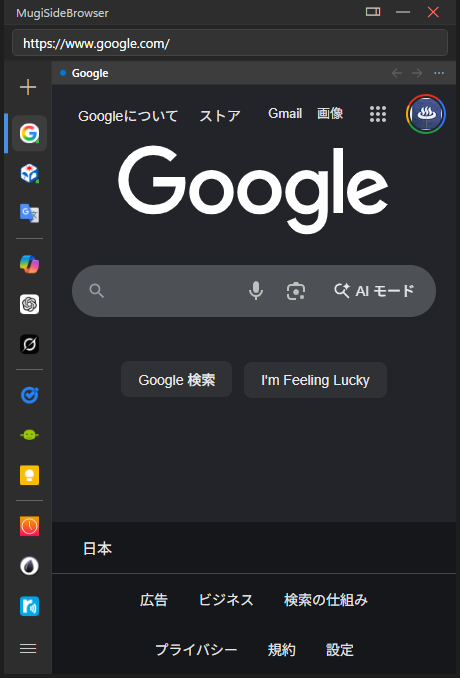

# MugiSideBrowser

[English](#english) | [日本語](#日本語)

---

## English

A sidebar-style browser that sits on the edge of the Windows desktop, allowing you to view websites without cluttering your workspace. It features layout control so that it doesn't overlap with other windows, similar to the sidebar in Microsoft Edge.

### 🌟 Key Features

#### 1. Flexible Window Display Modes
Switch between three modes depending on your desktop workflow:
*   **Always-on-Display Mode (AppBar)**: Anchored to the left or right edge of the screen. Automatically adjusts the desktop's work area (Work Area) so other windows do not overlap. The width is resizable (300px - 800px) by dragging the inner edge.
*   **Auto-Hide Mode (AutoHide)**: Hidden as a thin 2px line at the screen edge under normal conditions, and slides in smoothly (CubicEase Out, 200ms) when the mouse cursor approaches the trigger zone (within 5px).
*   **Floating Mode (Normal/Floating)**: Acts as a standard window in the taskbar, not topmost, and resizable on all sides.

#### 2. Up to 3-Split Screen Layout
Allows horizontal split layouts up to 3 screens (Top, Middle, Bottom panes) to make the most of the vertical sidebar space.
*   Drag and drop pane headers to swap content between panes easily.
*   Adjust individual heights dynamically using `GridSplitter`.
*   The active pane is visually highlighted (indicator dot + bold text) and synchronizes with the address bar and navigation (Back/Forward).

#### 3. Favorites & Vertical Tab Bar
Bookmarks function directly as browser tabs.
*   Favicons are aligned vertically in the sidebar dock, with support for vertical drag-and-drop reordering and custom separators.
*   **Status Indicators**:
    *   **Active (Blue bar)**: Displayed in the currently active pane.
    *   **Open (Green bar)**: Displayed in one of the split-screen panes.
    *   **Loaded (Green dot)**: WebView2 instance is active and loaded in memory.
*   Automatic favicon fetching from WebView2, falling back to the DuckDuckGo Favicon API or local resources.

#### 4. Memory Saving (Tab Sleep)
Minimizes RAM consumption even when opening multiple panes and bookmarks.
*   Closing a tab (putting it to sleep) via the right-click context menu disposes of its WebView2 instance and completely frees memory.
*   Sleeping panes display a placeholder screen and can be resumed instantly with a single click.

### 🛠 System Requirements

*   **OS**: Windows 10 / 11
*   **Framework**: .NET 8 / 9 (WPF)
*   **Browser Engine**: Microsoft Edge WebView2

### 📄 License

This project is licensed under the **[MIT No Attribution (MIT-0)](LICENSE)** license.

*   Commercial use, modification, distribution, and sublicensing are allowed without any restrictions.
*   **No attribution is required** (including copyright notices or permission notices in copies or distributions is completely optional).
*   The software is provided "AS-IS", without warranty of any kind.

> [!IMPORTANT]
> **License Transition Notice**
> Code in past versions and commit history prior to the license change on May 23, 2026 (MIT-0 transition), remains subject to the public domain **[CC0 1.0 Universal]** license.

### Download

[Download](https://github.com/hamano1204/mugi-side-browser/releases/latest)

---

## 日本語

Windowsのデスクトップ端に常駐し、作業スペースを圧迫せずにWebサイトを表示できるサイドバー型ブラウザです。Microsoft Edgeのサイドバーのように、他のウィンドウと重なり合わないレイアウト制御を備えています。

### 🌟 主な機能

#### 1. 柔軟なウィンドウ表示モード
デスクトップでの常駐スタイルに合わせて、以下の3つのモードを切り替え可能です。
*   **常時表示モード (AppBar)**: 画面の右端または左端に固定。他のウィンドウを押し出し、重ならない作業領域を確保します。内側の境界線をドラッグして幅をリサイズ可能。
*   **自動隠しモード (AutoHide)**: 通常時は画面端に隠れ、マウスカーソルを近づけるとスムーズにスライドイン表示します。
*   **自由配置モード (Normal/Floating)**: 通常のウィンドウとして任意の場所に配置でき、リサイズも自由に行えます。

#### 2. 最大3分割のスプリットスクリーン
限られたサイドバー領域を有効活用するため、最大3画面（上・中・下）の分割表示に対応しています。
*   ヘッダーのドラッグ＆ドロップでペインの位置を簡単に入れ替え。
*   `GridSplitter` による各ペインの高さ調整。
*   アクティブなペインとアドレスバー・ナビゲーション（戻る・進む）の自動連動。

#### 3. お気に入り＆垂直タブ機能
お気に入りがそのままブラウザのタブとして機能します。
*   サイドバーのドック領域に縦一列でファビコンが並び、ドラッグ＆ドロップで順序変更が可能。
*   **状態インジケーター**: Active（アクティブペインで表示中）、Open（いずれかのペインで表示中）、Loaded（メモリロード中）の3つの状態を視覚的に表示。

#### 4. メモリ節約（スリープ）機能
多数のお気に入りやペインを開いても、メモリ（RAM）を無駄に消費しない仕組みを備えています。
*   不要になったタブを閉じる（スリープ状態にする）ことで、WebView2インスタンスを破棄してメモリを完全に解放。
*   スリープ中のペインはプレースホルダー画面になり、クリック一つで瞬時に再読み込み（レジューム）可能。

### 🛠 動作環境

*   **OS**: Windows 10 / 11
*   **フレームワーク**: .NET 8 / 9 (WPF)
*   **ブラウザエンジン**: Microsoft Edge WebView2

### 📄 ライセンスについて

本プロジェクトは **[MIT No Attribution (MIT-0)](LICENSE)** ライセンスのもとで公開されています。

*   商用利用、修正、配布、サブライセンスが制限なく許可されています。
*   **複製時・配布時の著作権表示および許諾表示の義務はありません**（作成者情報の記載は任意です）。
*   本ソフトウェアは無保証であり、使用による一切の責任を作者は負いません。

> [!IMPORTANT]
> **ライセンス移行に関する注意点**
> 2026年5月23日のライセンス変更（MIT-0移行）以前の過去のバージョンおよびコミット履歴に含まれるコードについては、パブリックドメインの **[CC0 1.0 Universal]** が適用されます。

### ダウンロード

[ダウンロード](https://github.com/hamano1204/mugi-side-browser/releases/latest)

---

## Screenshots / スクリーンショット

